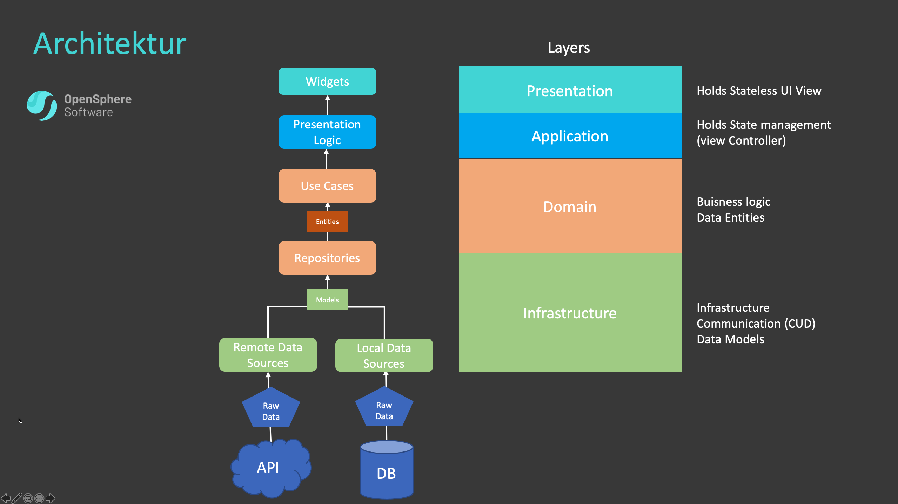

# Todo App - Clean Architecture

## Architecture

Keeping your code clean and tested are the two most important development practices. In Flutter, this is even more true than with other frameworks. On one hand, it's nice to hack a quick app together, on the other hand, larger projects start falling apart when you mix the business logic everywhere. Even state management patterns like BLoC are not sufficient in themselves to allow for easily extendable codebase.

This is where we can make use of clean architecture and test driven development. AWe should all try to separate code into independent layers and depend on abstractions instead of concrete implementations.

High-Level overview of the architecture design we will use in this Project:

For state Management we will use the Bloc Pattern.

Our Backend will be built in Firebase. Auth + Realtime Database
